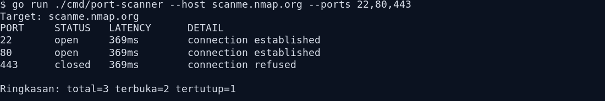

# port-scanner

<div align="center">

CLI berbasis Go untuk melakukan pemindaian port TCP pada host tertentu.


</div>

---

## Ringkasan

`port-scanner` dibuat untuk kebutuhan pemindaian port TCP dengan cara yang sederhana, cepat, dan mudah dijalankan langsung dari terminal. Tool ini mendukung daftar port tunggal maupun range port, pemindaian paralel, serta output yang bisa dibaca langsung atau disimpan ke file. Hasil scan diurutkan agar port terbuka tampil lebih dulu, dan pada port tertentu tool ini mencoba membaca banner awal jika tersedia.

## Persyaratan

- Go 1.24 atau versi yang lebih baru

## Instalasi

Jalankan langsung dari source:

```bash
go run ./cmd/port-scanner --host 127.0.0.1 --ports 22,80,443
```

Atau build menjadi binary:

```bash
go build -o port-scanner ./cmd/port-scanner
./port-scanner --host 127.0.0.1 --ports 22,80,443
```

## Fitur

- Mendukung port tunggal dan range port
- Pemindaian paralel dengan jumlah worker yang dapat diatur
- Output `table`, `json`, dan `csv`
- Opsi menyimpan hasil ke file
- Opsi untuk menampilkan hanya port yang terbuka
- Banner grabbing sederhana pada port yang merespons
- Progress indicator saat scan dijalankan di terminal
- Ringkasan hasil pemindaian
- Pengujian dasar untuk parser dan proses scan

## Menjalankan Project

```bash
go run ./cmd/port-scanner --host 127.0.0.1 --ports 22,80,443,8000-8100
```

## Opsi

- `--host` target host atau IP
- `--ports` daftar port, contoh `22,80,443,8000-8100`
- `--timeout` timeout koneksi per port
- `--concurrency` jumlah worker paralel
- `--format` `table`, `json`, atau `csv`
- `--output` simpan hasil ke file
- `--open-only` hanya menampilkan port terbuka

## Contoh Penggunaan

Scan dasar:

```bash
go run ./cmd/port-scanner --host scanme.nmap.org --ports 22,80,443
```

Output JSON:

```bash
go run ./cmd/port-scanner --host 127.0.0.1 --ports 22-30 --format json
```

Simpan hasil ke file:

```bash
go run ./cmd/port-scanner --host 127.0.0.1 --ports 22-30 --format json --output results.json
```

Output CSV:

```bash
go run ./cmd/port-scanner --host 127.0.0.1 --ports 22-30 --format csv
```

Tampilkan hanya port terbuka:

```bash
go run ./cmd/port-scanner --host 127.0.0.1 --ports 1-1024 --open-only
```

## Contoh Output

```text
Target: scanme.nmap.org
PORT     STATUS   LATENCY      DETAIL
22       open     369ms        connection established
80       open     369ms        connection established
443      closed   369ms        connection refused

Ringkasan: total=3 terbuka=2 tertutup=1
```

## Terminal Snapshot


